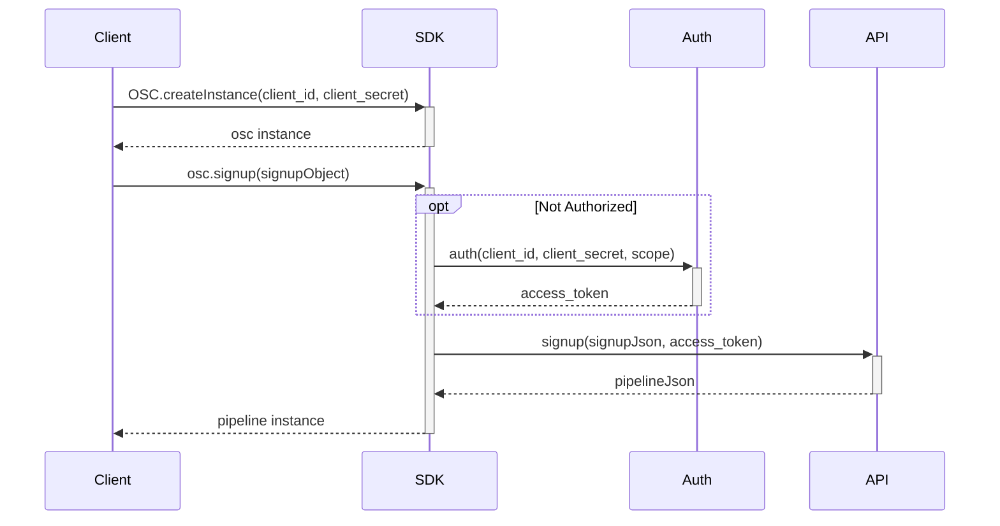
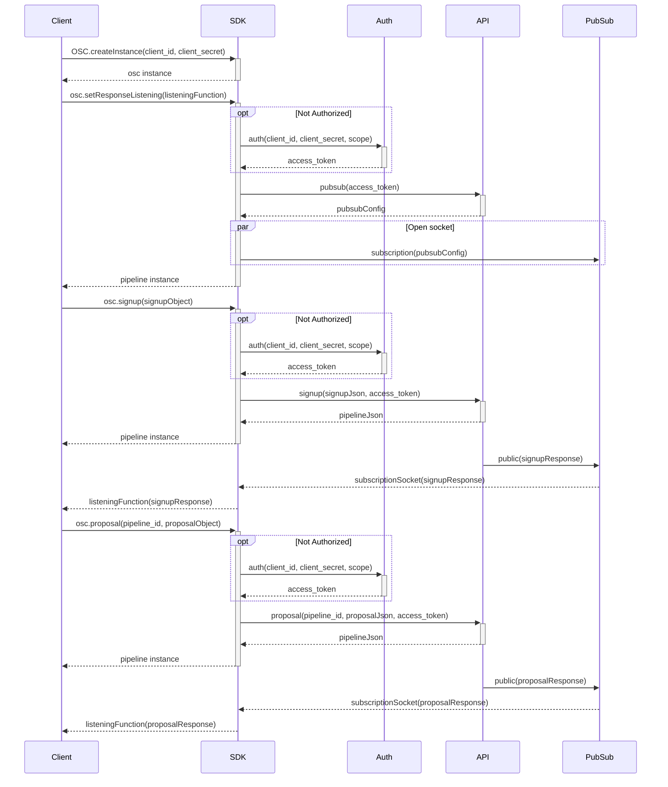
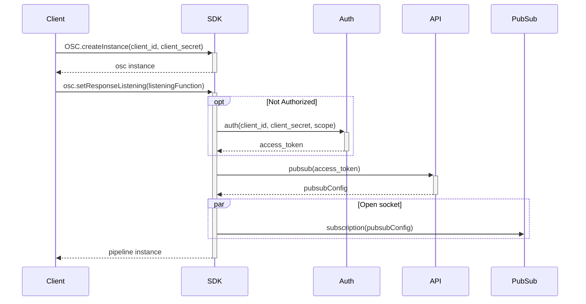
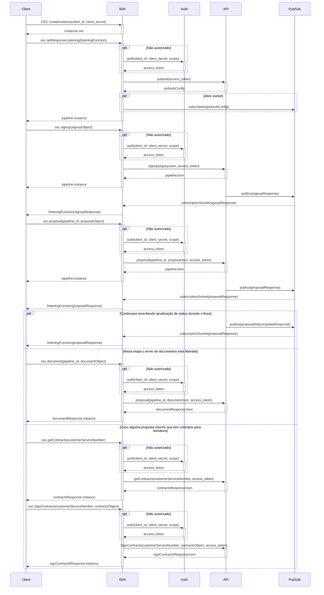

# Open Source Credit SDK Node.js

#### A SDK made in Node for the Open Source Credit project

## 🔐 Credentials

First of all you need an access token. Head over to your github page go to Settings -> Developer Settings -> Personal Access Tokens -> Generate new token. You should click the following permissions:

- workflow;
- write: packages;
- delete: packages.

Now, head over to the repository osc-sdk-nodejs go to Settings -> Secrets -> New repository secret. Name the secret `COMPANY_NAME_TOKEN`. This token will be needed in the next step.

## 🚀 Installing

To run this application, you'll need [Git](https://git-scm.com) and [Node.js](https://nodejs.org/en/download/) (which comes with [npm](http://npmjs.com)) installed on your computer. After that, install [yarn](https://classic.yarnpkg.com/lang/en/docs/install/#windows-stable). From your command line:

```bash
# Create a repository
$ yarn init

# Go into the repository
$ cd REPOSITORY_NAME
```

Now you need to create a file called `.npmrc` and paste the following code:

```npmrc
@@Fitbank-Pagamentos-Eletronicos:registry=https://npm.pkg.github.com/
//npm.pkg.github.com/:_authToken=COMPANY_NAME_TOKEN
```

Now you can install the package by running:

```bash
yarn add @Fitbank-Pagamentos-Eletronicos/osc-sdk-nodejs
```

Now you can use the SDK for example:

```typescript
import { OSC } from '@Fitbank-Pagamentos-Eletronicos/osc-sdk-nodejs';

const instance = OSC.createInstance(
  process.env.client_id,
  process.env.client_secret,
  Scopes.api_external,
  'default'
);
```

## 🗂️ Folder Structure

```
📦osc-sdk-nodejs
┣ 📂.vscode
┃ ┗ 📜settings.json
┣ 📂node_modules
┣ 📂src
┃ ┣ 📂domains
┃ ┃ ┣ 📂enums
┃ ┃ ┣ 📜AllEnums
┃ ┣ 📜AllDomains
┃ ┣ 📂requests
┃ ┃ ┣ 📜AllRequests
┃ ┣ 📂tests
┃ ┃ ┣ 📂domains
┃ ┃ ┃ ┣ 📜AllDomainsTests
┃ ┃ ┣ 📂requests
┃ ┃ ┃ ┣ 📜AllRequestsTests
┃ ┃ ┗ 📜index.test.ts
┃ ┗ 📂utils
┃ ┃ ┗ 📜Validations.ts
┣ 📜.gitignore
┣ 📜.prettierrc
┣ 📜babel.config.js
┣ 📜index.ts
┣ 📜jest.config.ts
┣ 📜package.json
┣ 📜README.md
┣ 📜tsconfig.json
┗ 📜yarn.lock
```

## 💯 How to run the tests

Some of the tests are named `NAME_OF_THE_FILE.test.ts` with the connotation `.test`, to test those files, you'll have to run with `yarn test NAME_OF_THE_FILE`. The others you can test with `ts-node NAME_OF_THE_FILE`.

## 🧾 Methods

The methods are on requests folder on the path `src/requests`. Are them:

- `DocumentAnalysis`: Send a document to analysis. The result is the `DocumentResponse` domain.

- `GetContracts`: Get the contracts for a proposal to be signed. The result is the `GetContract` domain.

- `oAuth`: Authentication token creation for use by endpoints. The result is the `AuthSucess` domain.

- `ProposalsRequest`: Collects and validates the necessary data for the creation of proposals according to the types of products selected. The result is the `PipelineProposal` domain.

- `Pubsub`: Gets the project id, topic id and other things. The result is the `PubSubRequest` domain.

- `PubsubSubscribe`: Uses the data returned from the Pubsub endpoint and create a listener.

- `SignContracts`: Sends data for signing a proposal contract. The result is the `Contract` domain.

- `SignupMatchRequest`: Collects and validates the necessary data for the creation of proposals according to the types of products selected. The result is the `Pipeline` domain.

- `SimpleProposalRequest`: Collects and validates the data necessary for the creation of digital account proposals. The result is the `PipelineProposal` domain.

- `SimpleSignUpRequest`: Make sign up of users (can return error if user already registered). The result is the `PipelineProposal` domain.

## 🛠️ How it works

- `DocumentAnalysis` - Endpoint: `/v2/process/document/${id}`: First of all you've to instance the `Auth` object and pass it as a parameter to the `SignUpMatchRequest` and you've to instance the `SignUpMatch` object too and pass it as a parameter to `SignUpMatchRequest`. After that, you've the `signUpId` from `SignUpMatchRequest`, this id is the parameter of the request. Instantiate the `Document` object and pass it as a parameter to the `DocumentAnalysis` with the `SignUpId` and `Auth` too. You can check an example on `src/tests/requests/DocumentAnalysis.ts`

- `GetContracts` - Endpoint `GET`: `/v2.1/contract/${customerServiceNumber}`: First of all you've to instance the `Auth` object and pass it as a parameter to the `GetContracts`, the first parameter is the `customerServiceNumber`. This number you get from the callback of `ProposalsRequest`.

- `OAuth` - Endpoint: `/auth`: You've to instance the `Auth` object and pass it as a parameter to the `OAuth`.

- `ProposalsRequest` - Endpoint: `/v2.1/process/proposal/${id}`: First of all you've to instance the `Auth` object and pass it as a parameter to the `signUpMatchRequest` and you've to instance the `SignUpMatch` object too and pass it as a parameter to `SignUpMatchRequest`. After that, you've the `signUpId` from `SignUpMatchRequest`, this id is the parameter of the request. Instantiate the `Proposal` object and pass it as a parameter to the `ProposalsRequest` with the `SignUpId` and `Auth` too. You can check an example on `src/tests/requests/DocumentAnalysis.ts`.

- `Pubsub` - Endpoint: `/v2.1/pubsub`: You've to instance the `Auth` object and pass it as a parameter to the `Pubsub`.

- `PubsubSubscribe` - Endpoint: `/v2.1/pubsub`: You've to create a object with the keys `topicId`, `subscriptionId`, `projectId` and `serviceAccount` with their respective values. You can check on `src/requests/requests/PubsubSubscribe.ts`.

- `SignContracts` - Endpoint `POST`: `/v2.1/contract/${customerServiceNumber}`: First of all you've to instance the `Auth` object and pass it as a parameter to the `SignContracts`. You also have to instance the `Contract` object too, it is the first parameter. The second parameter is the `customerServiceNumber`. This number you get from the callback of `ProposalsRequest`. And the third is the`Auth` object.

- `SignUpMatchRequest` - Endpoint: `/v2.1/process/signup`: First of all you've to instance the `Auth` object and pass it as a parameter to the `SignupMatchRequest` and you've to instance the `SignUpMatch` object too and pass it as a parameter to `SignUpMatchRequest`. The first parameter is the `SignUpMatch` and the second is the `Auth`.

- `SignUpMatchRequest` - Endpoint: `/v2.1/process/simple_proposal/${id}`: First of all you've to instance the `Auth` object. You've to instance the `simpleSignUp` object too and pass it as a parameter to `SimpleSignUpRequest` with the `Auth` as the second parameter. After that, you've the `simpleSignUpRequest.id` from `SimpleSignUpRequest`, this id is the parameter of the request. Now you've to instance the `proposal` object and pass it as the first parameter to the `SimpleProposalRequest`, the second is the id(`simpleSignUpRequest.id`) and the third is `Auth` object.

- `SignUpMatchRequest` - Endpoint: `/v2.1/process/simple_signup`: First of all you've to instance the `Auth` object and pass it as a parameter to the `SimpleSignUpRequest` and you've to instance the `SignUpMatch` object too and pass it as a parameter to `SimpleSignUp`. The first parameter is the `SimpleSignUp` and the second is the `Auth`.

## ☕ How to use

### :bookmark: SignUp

#### Flowchart



#### Codification

```typescript
const testingSignUp = async () => {
  const instance = OSC.createInstance(
    process.env.client_id,
    process.env.client_secret,
    Scopes.api_external,
    'default'
  );
  const signupMatch = new SignupMatch();
  const pipeline = instance?.signUpMatch(signupMatch);
  pipeline?.then((data) => {
    console.log(data);
  });
};

testingSignUp();
```

### :bookmark: SignUp and Proposal

#### Flowchart



### Codification

```typescript
const testingProposal = async () => {
  const instance = OSC.createInstance(
    process.env.client_id,
    process.env.client_secret,
    Scopes.api_external,
    'default'
  );
  const proposal = new Proposal();

  const signupMatch = new SignupMatch();

  const pipelineSignUp = JSON.parse(await instance?.signUpMatch(signupMatch));
  const id = pipelineSignUp.id;

  setTimeout(() => {
    const pipeline = instance?.proposal(id, proposal);
    pipeline?.then((data) => {
      console.log(data);
    });
  }, 10000);
};

testingProposal();
```

### :bookmark: Pubsub

#### Flowchart



### Codification

```typescript
const testingPubSubRequest = async () => {
  const instance = OSC.createInstance(
    process.env.client_id,
    process.env.client_secret,
    Scopes.api_external,
    'default'
  );

  const pipeline = instance?.pubsub();
  pipeline?.then((data) => {
    console.log(data);
  });
};

testingPubSubRequest();
```

### :bookmark: Full Flow

#### Flowchart



### Codification

```typescript
const testingFullFlow = async () => {
  const auth = new Auth();

  const signUP = new SignUpMatch();

  osc.createInstance(
    auth.getClient_id(),
    auth.getClient_secret(),
    auth.getScopes(),
    signUP.getName()
  );

  osc.auth();

  //Pubsub and PubsubSubscribe
  osc.setResponseListening(listeningFunction);

  const proposal = new Proposal();

  const signUpRequest = JSON.parse(await SignUpMatchRequest(signupMatch, auth));
  const signUpId = signUpRequest.id;

  const proposalRequest = JSON.parse(
    await ProposalsRequest(proposal, signUpId, auth)
  );

  const document = new Document();

  const documentRequest = JSON.parse(
    await DocumentAnalysis(document, signUpId, auth)
  );

  const getContractsRequest = JSON.parse(
    await GetContracts('20221213170333387004500', auth)
  );

  const signContractsRequest = JSON.parse(
    await SignContracts('20221213170333387004500', auth)
  );
};
testingFullFlow();
```
