# Open Source Credit SDK Node.js

#### A SDK made in Node for the Open Source Credit project

## 🚀 Installing

To clone and run this application, you'll need [Git](https://git-scm.com) and [Node.js](https://nodejs.org/en/download/) (which comes with [npm](http://npmjs.com)) installed on your computer. After that, install [yarn](https://classic.yarnpkg.com/lang/en/docs/install/#windows-stable). From your command line:

```bash
# Clone this repository
$ git clone https://github.com/Fitbank-Pagamentos-Eletronicos/osc-sdk-nodejs

# Go into the repository
$ cd osc-sdk-nodejs

# Install dependencies
$ yarn install
```

## 🔐 Credentials

Lorem ipsum dolor sit amet, consectetur adipiscing elit, sed do eiusmod tempor incididunt ut labore et dolore magna aliqua. Ut enim ad minim veniam, quis nostrud exercitation ullamco laboris nisi ut aliquip ex ea commodo consequat.

## 🗂️ Folder Structure

```
📦osc-sdk-nodejs
┣ 📂.vscode
┃ ┗ 📜settings.json
┣ 📂node_modules
┣ 📂src
┃ ┣ 📂domains
┃ ┃ ┣ 📂enums
┃ ┃ ┣ 📜AllEnums
┃ ┣ 📜AllDomains
┃ ┣ 📂requests
┃ ┃ ┣ 📜AllRequests
┃ ┣ 📂tests
┃ ┃ ┣ 📂domains
┃ ┃ ┃ ┣ 📜AllDomainsTests
┃ ┃ ┣ 📂requests
┃ ┃ ┃ ┣ 📜AllRequestsTests
┃ ┃ ┗ 📜index.test.ts
┃ ┗ 📂utils
┃ ┃ ┗ 📜Validations.ts
┣ 📜.gitignore
┣ 📜.prettierrc
┣ 📜babel.config.js
┣ 📜index.ts
┣ 📜jest.config.ts
┣ 📜package.json
┣ 📜README.md
┣ 📜tsconfig.json
┗ 📜yarn.lock
```

## 💯 How to run the tests

Some of the tests are named `NAME_OF_THE_FILE.test.ts` with the connotation `.test`, to test those files, you'll have to run with `yarn test NAME_OF_THE_FILE`. The others you can test with `ts-node NAME_OF_THE_FILE`.

## 🧾 Methods

The methods are on requests folder on the path `src/requests`. Are them:

- `DocumentAnalysis`: Send a document to analysis. The result is the `DocumentResponse` domain.

- `GetContracts`: Get the contracts for a proposal to be signed. The result is the `GetContract` domain.

- `oAuth`: Authentication token creation for use by endpoints. The result is the `AuthSucess` domain.

- `ProposalsRequest`: Collects and validates the necessary data for the creation of proposals according to the types of products selected. The result is the `PipelineProposal` domain.

- `Pubsub`: Gets the project id, topic id and other things. The result is the `PubSubRequest` domain.

- `PubsubSubscribe`: Uses the data returned from the Pubsub endpoint and create a listener.

- `SignContracts`: Sends data for signing a proposal contract. The result is the `Contract` domain.

- `SignupMatchRequest`: Collects and validates the necessary data for the creation of proposals according to the types of products selected. The result is the `Pipeline` domain.

- `SimpleProposalRequest`: Collects and validates the data necessary for the creation of digital account proposals. The result is the `PipelineProposal` domain.

- `SimpleSignUpRequest`: Make sign up of users (can return error if user already registered). The result is the `PipelineProposal` domain.

## 🛠️ How it works

- `DocumentAnalysis` - Endpoint: `/v2/process/document/${id}`: First of all you've to instance the `Auth` object and pass it as a parameter to the `SignUpMatchRequest` and you've to instance the `SignUpMatch` object too and pass it as a parameter to `SignUpMatchRequest`. After that, you've the `signUpId` from `SignUpMatchRequest`, this id is the parameter of the request. Instantiate the `Document` object and pass it as a parameter to the `DocumentAnalysis` with the `SignUpId` and `Auth` too. You can check an example on `src/tests/requests/DocumentAnalysis.ts`

- `GetContracts` - Endpoint `GET`: `/v2.1/contract/${customerServiceNumber}`: First of all you've to instance the `Auth` object and pass it as a parameter to the `GetContracts`, the first parameter is the `customerServiceNumber`. This number you get from the callback of `ProposalsRequest`.

- `OAuth` - Endpoint: `/auth`: You've to instance the `Auth` object and pass it as a parameter to the `OAuth`.

- `ProposalsRequest` - Endpoint: `/v2.1/process/proposal/${id}`: First of all you've to instance the `Auth` object and pass it as a parameter to the `signUpMatchRequest` and you've to instance the `SignUpMatch` object too and pass it as a parameter to `SignUpMatchRequest`. After that, you've the `signUpId` from `SignUpMatchRequest`, this id is the parameter of the request. Instantiate the `Proposal` object and pass it as a parameter to the `ProposalsRequest` with the `SignUpId` and `Auth` too. You can check an example on `src/tests/requests/DocumentAnalysis.ts`.

- `Pubsub` - Endpoint: `/v2.1/pubsub`: You've to instance the `Auth` object and pass it as a parameter to the `Pubsub`.

- `PubsubSubscribe` - Endpoint: `/v2.1/pubsub`: You've to create a object with the keys `topicId`, `subscriptionId`, `projectId` and `serviceAccount` with their respective values. You can check on `src/requests/requests/PubsubSubscribe.ts`.

- `SignContracts` - Endpoint `POST`: `/v2.1/contract/${customerServiceNumber}`: First of all you've to instance the `Auth` object and pass it as a parameter to the `SignContracts`. You also have to instance the `Contract` object too, it is the first parameter. The second parameter is the `customerServiceNumber`. This number you get from the callback of `ProposalsRequest`. And the third is the`Auth` object.

- `SignUpMatchRequest` - Endpoint: `/v2.1/process/signup`: First of all you've to instance the `Auth` object and pass it as a parameter to the `SignupMatchRequest` and you've to instance the `SignUpMatch` object too and pass it as a parameter to `SignUpMatchRequest`. The first parameter is the `SignUpMatch` and the second is the `Auth`.

- `SignUpMatchRequest` - Endpoint: `/v2.1/process/simple_proposal/${id}`: First of all you've to instance the `Auth` object. You've to instance the `simpleSignUp` object too and pass it as a parameter to `SimpleSignUpRequest` with the `Auth` as the second parameter. After that, you've the `simpleSignUpRequest.id` from `SimpleSignUpRequest`, this id is the parameter of the request. Now you've to instance the `proposal` object and pass it as the first parameter to the `SimpleProposalRequest`, the second is the id(`simpleSignUpRequest.id`) and the third is `Auth` object.

- `SignUpMatchRequest` - Endpoint: `/v2.1/process/simple_signup`: First of all you've to instance the `Auth` object and pass it as a parameter to the `SimpleSignUpRequest` and you've to instance the `SignUpMatch` object too and pass it as a parameter to `SimpleSignUp`. The first parameter is the `SimpleSignUp` and the second is the `Auth`.

## ☕ How to use

- ### SignUp

#### Flowchart

```mermaid
sequenceDiagram
    participant Client
    participant SDK
    participant Auth
    participant API

    Client->>+SDK: OSC.createInstance(client_id, client_secret)
    SDK-->>-Client: instancia osc

    Client->>+SDK: osc.signup(signupObject)
        opt Não autorizado
            SDK->>+Auth: auth(client_id, client_secret, scope)
            Auth-->>-SDK: access_token
        end
        SDK->>+API: signup(signupJson, access_token)
        API-->>-SDK: pipelineJson
    SDK-->>-Client: pipeline instance
```



#### Codification

```typescript
const testingSignUP = async () => {
  const auth = new Auth();
  auth.setClient_id('iuri.mendes--------bde4-84fb8eb9865e');
  auth.setClient_secret(
    '2e1995260d53d2b028a2a47553bd823042c589226e15d4994a466a97ce692271'
  );
  auth.setScopes(Scopes.api_external);

  const signUP = new SignupMatch();
  signUP.setCpf('60343933373');
  signUP.setName('John Doe');

  const osc = new OSC(
    auth.getClient_id(),
    auth.getClient_secret(),
    auth.getScopes(),
    signUP.getName()
  );

  OSC.createInstance(
    auth.getClient_id(),
    auth.getClient_secret(),
    auth.getScopes(),
    signUP.getName()
  );
  console.log(OSC.getInstance(signUP.getName()));
  osc.auth();
  console.log(await osc.getToken());
};
testingSignUP();
```
